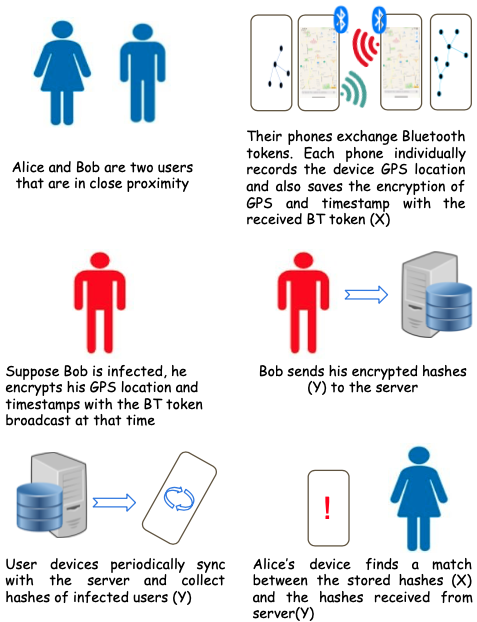
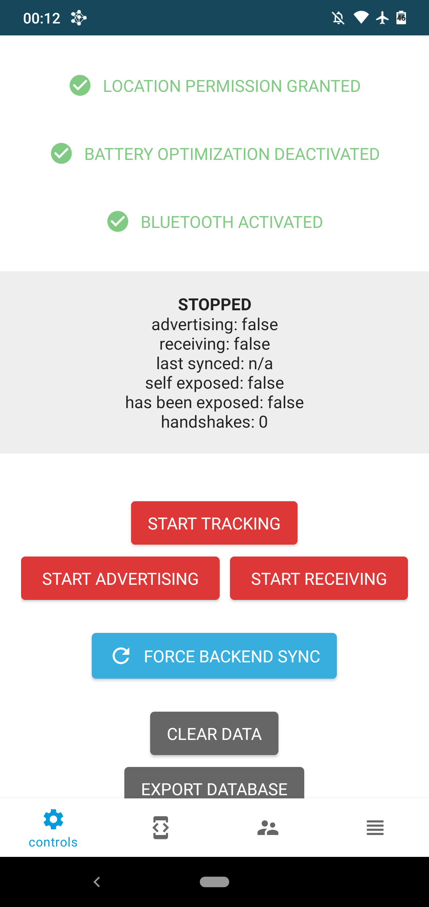
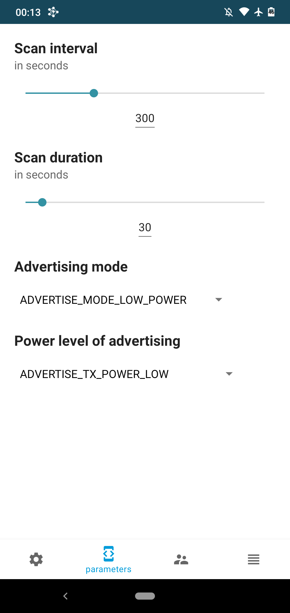
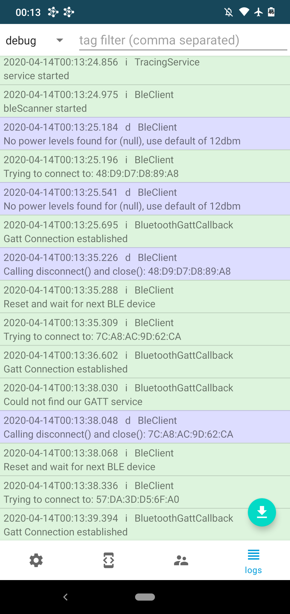

# ASU-FACT SDK For Android

## ASU-FACT - Arizona State University - Federated Analytics based Contact Tracing platform
Existing contact tracing protocols based solely on exchange of random tokens via Bluetooth Low Energy (BLE) are vulnerable to a range of attacks. Moreover, they do not leverage the rich device-level data for providing intelligent assessment and useful indicators. FACT provides a secure Contact Tracing (CT) protocol based on BLE+GPS, and applies a refined paradigm of federated learning to leverage both device-level data and server capabilities. FACT enable private, secure CT for prevention and intervention by including hotspot identification, user alerts, and continual assessment of user COVID-19 risk. This approach guarantees a private, secure, and verifiable way to (i) evaluate a user’s need for testing or their resilience to exposure, and (ii) assess herd immunity across the population.
Goals of the FACT framework:
Secure, Resilient and Scalable Contact Tracing
Assessing User Risk in a Federated Manner
Scalable and Private FL for FACT

# Introduction
The overview of the protocol is as shown in the figure below.
<p align="center">
    
</p>
When two users are in close proximity, the devices exchange random tokens via BLE. Each device periodically stores the user location as well. The random tokens are augmented with location data. If the user is infected, the device computes hashes of broadcast tokens with the location and timestamp of broadcast, and then shared with the server. When a device receives a token, it stores the hash of the received token, geohash, and timestamp. Devices periodically query the server to receive the newly uploaded infected user hashes. These hashes are compared with hashes of received tokens and an exposure is reported if there’s a match.
<!-- For determining areas of high-risk, the goal is to research and develop a solution based on secure aggregation techniques. Each user device stores the location trace. By securely aggregating traces of multiple positively diagnosed users, the locations above a threshold number of visits can be regarded as hotspots.  -->

## SDK for Android
This repository contains the Software Development Kit code based on Android for the secure contact tracing protocol using Bluetooth+GPS. It extends from the DP-3T prestandard SDK for Android, which is based on BLE. The Decentralised Privacy-Preserving Proximity Tracing ([DP-3T](https://github.com/DP-3T)) project is an open protocol for COVID-19 proximity tracing using BLE. It has been implemented as an open source protocol in the form of an app and server. We modify and extend the DP3T BT based protocol, in which BT tokens are exchanged, and a key is shared with the server when a user is infected. In our protocol, the BT tokens are augmented with location data. For an infected user, the Hashes of BT token, location co-ordinates and time stamp are shared with the server. Extensions made in this SDK are:
* Periodic Location Updates: The SDK includes a class that provides periodic device location updates.
* Storage of received BT token + Geohash + timestamp as a hash.
* Fetching hashes of infected users from server and matching with received hashes to provide potential exposure update.

## Repositories
* Android SDK & Calibration app: [dp3t-sdk-android](https://github.com/DP-3T/sdk-android-prestandard)
* Android App: [dp3t-app-android](https://github.com/ASU-FACT/calibration-app)
* Backend-A SDK: [dp3t-sdk-backend](https://github.com/ASU-FACT/backend-A)
* Backend-B SDK: [dp3t-sdk-backend](https://github.com/ASU-FACT/backend-B)

## Work in Progress
The SDK for Android contains code for prototyping and testing the protocol, and is not yet complete. It has not yet been reviewed or audited for security and compatibility. 


## Calibration App
Included in this repository is a Calibration App that can run, debug and test the SDK directly without implementing it in a new app first. It collects additional data and stores it locally into a database to allow for tests with phones from different vendors. Various parameters of the SDK are exposed and can be changed at runtime. Additionally it provides an overview of how to use the SDK.

<p align="center">
  
  
  
</p>

The below documentation is from DP3T SDK for Android
## Function overview

### Initialization
Name | Description | Function Name
---- | ----------- | -------------
initWithAppId | Initializes the SDK and configures it |  `public static void init(Context context, String appId)`

### Methods 
Name | Description | Function Name
---- | ----------- | -------------
start | Starts Bluetooth tracing | `public static void start(Context context)`
stop | Stops Bluetooth tracing | `public static void stop(Context context)`
sync | Pro-actively triggers sync with backend to refresh exposed list | `public static void sync(Context context)`
status | Returns a TracingStatus-Object describing the current state. This contains:<br/>- `numberOfContacts` : `int` <br /> - `advertising` : `boolean` <br /> - `receiving` : `boolean` <br /> - `lastSyncUpdate`:`long` <br />- `infectionStatus`:`InfectionStatus` <br />- `matchedContacts`:`List<MatchedContact>` <br /> - `errors` (permission, bluetooth disabled, no network, ...) : `List<ErrorState>` | `public static TracingStatus getStatus(Context context)`
I infected | This method must be called upon positive test. | `public static void sendIAmInfected(Context context, Date onset, ExposeeAuthData exposeeAuthData, CallbackListener<Void> callback)`
clearData | Removes all SDK related data (key and database) and de-initializes SDK | `public static void clearData(Context context, Runnable onDeleteListener)`

### Broadcast
Name | Description | Function Name
---- | ----------- | -------------
status update | Status was updated; new status can be fetched with the `status` method | Register for Broadcast with the `IntentFilter` returned by `public static IntentFilter getUpdateIntentFilter()`


## Building a AAR
To build an aar file that you can include in your project use in the folder dp3t-sdk:
```sh
$ ./gradlew assemble
```
The library is generated under sdk/build/outputs/aar

## Integrating into a Project
The SDK is available on JCenter and can be included directly as Gradle dependency:
```groovy
dependencies {
implementation 'org.dpppt:dp3t-sdk-android:0.1.0'
}
```

## Using the SDK

### Initialization
In your Application.onCreate() you have to initialize the SDK with:
```java
DP3T.init(getContext(), "com.example.your.app");
```
The provided app name has to be registered in the discovery service on [Github](https://github.com/DP-3T/dp3t-discovery/blob/master/discovery.json)

### Start / Stop tracing
To start and stop tracing use
```java
DP3T.start(getContext());
DP3T.stop(getContext());
```
Make sure that the user has the permission Manifest.permission.ACCESS_FINE_LOCATION granted (this coarse-grained permission is required for any app with Bluetooth activity; our SDK uses BLE beaconing but does not require any "location" data), Bluetooth is enabled and BatteryOptimization is disabled. BatteryOptimization can be checked with
```java
PowerManager powerManager = (PowerManager) getContext().getSystemService(Context.POWER_SERVICE);
boolean batteryOptDeact = powerManager.isIgnoringBatteryOptimizations(getContext().getPackageName());
```
and for asking the user to disable the optimization use:
```java
startActivity(new Intent(Settings.ACTION_REQUEST_IGNORE_BATTERY_OPTIMIZATIONS,
					Uri.parse("package:" + getContext().getPackageName())));
```

Tracing is automatically restarted if the phone is rebooted by the SDK, it is enough to call `start()` once from your app.

### Customize tracing notification
The tracing happens in a foreground service and therefore displays a notification. This notification can be customized by defining the following string resources in your project:
```xml
<?xml version="1.0" encoding="utf-8"?>
<resources>
	<string name="dp3t_sdk_service_notification_channel">@string/app_name</string>
	<string name="dp3t_">@string/app_name</string>
	<string name="dp3t_sdk_service_notification_text">@string/foreground_service_notification_text</string>
</resources>
```
To change the notification icon add your custom ic_handshakes drawable to the project.

### Checking the current tracing status
```java
TracingStatus status = DP3T.getStatus(getContext());
```
The TracingStatus object contains all information of the current tracing status.

To get notified when the status changes, you can register a broadcast receiver with
```java
getContext().registerReceiver(broadcastReceiver, DP3T.getUpdateIntentFilter());
```

### Report user exposed
```java
DP3T.sendIWasExposed(getContext(), null, new CallbackListener<Void>() {
				@Override
				public void onSuccess(Void response) {
				}

				@Override
				public void onError(Throwable throwable) {
				}
			});
```

### Sync with backend for exposed users
The SDK automatically registers a periodic Job to sync with the backend for new exposed users. If you want to trigger a sync manually (e.g., upon a push from your backend) you can use:
```java
DP3T.sync(getContext());
```
Make sure you do not call this method on the UI thread, because it will perform the sync synchronously.

## License
This project is licensed under the terms of the MPL 2 license. See the [LICENSE](LICENSE) file. 
<!-- -->
